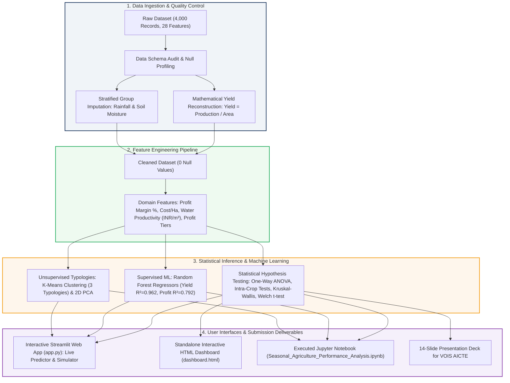

# Seasonal Agriculture Performance Analysis
**VOIS AICTE Emerging Technologies Internship — Major Project (Batch 1, 2026–2027)**  
*Author:* **Dhanish Ladwani**  
*Repository:* [https://github.com/dhanish0711/Seasonal-Agriculture-Performance-Analysis.git](https://github.com/dhanish0711/Seasonal-Agriculture-Performance-Analysis.git)  

[](https://www.python.org/)
[](https://streamlit.io/)
[](https://scikit-learn.org/)
[](https://pandas.pydata.org/)
[](https://numpy.org/)
[](https://scipy.org/)
[](https://plotly.com/)
[](https://jupyter.org/)
[]()

---

## 📌 Project Overview
This major project conducts an end-to-end data analytics and machine learning investigation into **4,000 multi-regional agricultural operations** across **8 Indian States** (*Punjab, Maharashtra, Tamil Nadu, Karnataka, Gujarat, Andhra Pradesh, Telangana, Madhya Pradesh*) and **10 Districts**, covering **8 major crop varieties** (*Rice, Wheat, Maize, Cotton, Pulses, Groundnut, Chilli, Sugarcane*) observed across **Kharif (Monsoon)**, **Rabi (Winter)**, and **Zaid (Summer)** cropping cycles.

### The Problem
Agricultural activities are intensely vulnerable to seasonal variations in environmental conditions, water availability, farming practices, and market prices. Raw farm data records inputs and outputs but does not explain *how*, *why*, and *by what magnitude* agricultural performance diverges across seasons.

This project decrypts the macro and micro drivers of seasonal performance divergence, establishes statistical significance through parametric and non-parametric tests, builds high-accuracy machine learning predictors, and formulates evidence-based planning models for stakeholders.

---

## 🏗️ System & Solution Architecture



---

## 🌟 Key Discoveries & Highlights

1. **Macro Seasonal Divergence:**
   - **Kharif (Monsoon):** Highest average yield (5.64 t/ha) and net profit (**+₹1,78,915**), but suffers peak pest/disease risk (**54.5%**) due to high rainfall (852 mm) and humidity (71.8%).
   - **Rabi (Winter):** Most stable operating cycle with the lowest production costs (**₹5,13,837**) and consistent profitability (**+₹87,689**).
   - **Zaid (Summer):** Severe economic distress with highest water consumption (**6,420 m³**) and highest cost (**₹5,43,977**), resulting in a net negative average return (**-₹24,805**) and a 54.4% farm failure rate.
2. **The Staple Food Grain Paradox:**
   - Commercial cash crops (**Sugarcane** and **Chilli**) sustain massive profitability (+₹4.5L to +₹10.0L) across all three seasons.
   - In contrast, staple food grains (**Rice, Wheat, Maize**) suffer structural operational losses across all cycles due to high operating costs (~₹5.2 Lakhs) relative to farm-gate prices.
3. **The Micro-Irrigation Summer Shield:**
   - In Zaid, conventional **Flood irrigation** incurs massive deficits (**-₹69,787**), while precision **Drip (+₹21,292)** and **Sprinkler (+₹57,909)** irrigation remain profitable while saving over 2,200 m³/ha in water.
4. **Machine Learning Model Accuracy:**
   - **Crop Yield Predictor (Random Forest):** $R^2 = 0.962$, $\text{RMSE} = 2.716\text{ t/ha}$, $\text{MAE} = 0.763\text{ t/ha}$.
   - **Net Profit Predictor (Random Forest):** $R^2 = 0.792$, $\text{RMSE} = ₹2,41,398$, $\text{MAE} = ₹1,54,577$.
   - **Dominant Profit Drivers:** Soil pH (22.6%), Crop Choice (Sugarcane/Cotton/Chilli), Farm Area (11.5%), and Water Volume (5.9%).
5. **Statistical Verification:**
   - One-Way ANOVA across Seasons for Net Profit: $F = 34.292, \; p = 1.71 \times 10^{-15}$.
   - Intra-Crop Yield ANOVA: **Every single crop variety exhibits statistically significant seasonal yield variation ($p < 0.0001$)**.

---

## 📂 Repository Structure

```
├── Seasonal_Agriculture_Performance_Analysis.ipynb  # Fully executed publication-grade Jupyter Notebook (24 cells)
├── app.py                                           # Interactive Streamlit Web Application & Live ML Predictor
├── dashboard.html                                   # Standalone interactive HTML dashboard (Open directly in browser)
├── PROJECT_REPORT.md                                # Comprehensive 9-section technical research report
├── VOIS_Major_Project_PPT_Submission_Template.pptx  # Populated 14-slide presentation deck (Template name)
├── VOIS_Major_Project_PPT_Final_Submission.pptx     # Populated 14-slide presentation deck (Submission name)
├── seasonal_agriculture_performance_dataset.csv     # Raw dataset (4,000 records, 28 columns)
├── data_cleaned/
│   ├── cleaned_seasonal_agriculture_performance.csv # Cleaned, imputed, and clustered dataset (39 columns)
│   └── statistical_ml_summary.json                  # Serialized ANOVA, t-test, and ML evaluation metrics
├── models/
│   └── model_bundle.joblib                          # Pre-trained Random Forest regressors, Scalers, & K-Means models
├── output_visualizations/                           # High-resolution 300 DPI figures
│   ├── fig1_seasonal_macro_metrics.png              # Multi-panel macro climatic and profit distributions
│   ├── fig2_crop_seasonal_economics.png             # Crop profit bars and yield heatmaps across seasons
│   ├── fig3_irrigation_resilience.png               # Irrigation method economics and water efficiency
│   ├── fig4_ml_feature_importance.png               # Random Forest feature importance rankings
│   └── fig5_state_seasonal_dynamics.png             # State-wise seasonal profitability heatmap
├── generate_analysis_and_charts.py                  # Pipeline script to generate figures and metrics
├── build_presentation.py                            # Automated PowerPoint slide builder script
├── build_and_execute_notebook.py                    # Automated Jupyter Notebook builder and executor
└── train_and_save_models.py                         # Model training and clustering script
```

---

## 🚀 How to Run

### 1. View the Jupyter Notebook
Open [`Seasonal_Agriculture_Performance_Analysis.ipynb`](Seasonal_Agriculture_Performance_Analysis.ipynb) in Jupyter Lab, VS Code, or Jupyter Notebook. All 24 cells are pre-executed with interactive tables, statistical ANOVA summaries, and seaborn plots.

```bash
jupyter notebook Seasonal_Agriculture_Performance_Analysis.ipynb
```

### 2. Launch the Interactive Web Dashboard
Run the multi-tab Streamlit web application:

```bash
streamlit run app.py
```
*Features:*
- **Executive KPI Dashboard:** Real-time filtering by state, crop, season, and irrigation technology.
- **Climate & Irrigation Simulator:** What-if calculator estimating profit gain and groundwater conserved.
- **AI Real-Time Predictor:** Sliders for soil pH, weather, fertilizer, and farm size to forecast Yield and Net Profit.
- **Unsupervised Typologies:** Interactive 2D PCA cluster visualization of farm groups.

### 3. Open Standalone HTML Dashboard
Double-click [`dashboard.html`](dashboard.html) in Windows Explorer to immediately open the responsive Chart.js dashboard in Google Chrome, Microsoft Edge, or Firefox without requiring Python.

---

## 📊 Presentation Submission
The PowerPoint presentation [`VOIS_Major_Project_PPT_Submission_Template.pptx`](VOIS_Major_Project_PPT_Submission_Template.pptx) has been populated with:
- **Slide 1:** Title, Student Name (*Dhanish Ladwani*), College Name, and AICTE Student ID.
- **Slide 2:** Problem Statement.
- **Slide 3:** Comprehensive Project Description.
- **Slide 4:** End Users (Farmers, Agronomists, Financial Institutions, Policymakers).
- **Slide 5:** Technology Stack Used (Python, Scikit-Learn, Pandas, SciPy, Matplotlib, Streamlit).
- **Slide 6:** Results Executive Overview.
- **Slides 7–10:** Embedded 300 DPI analytical charts with detailed findings and insights.
- **Slide 11:** Future Scope & Strategic Roadmap.
- **Slide 12:** GitHub Repository Link.
- **Slide 13:** VOIS Data Visualization Course Completion Certificate placeholder.
- **Slide 14:** Conclusion & Acknowledgements.

---

## 📜 Citation & Credits
Developed as part of the **Vodafone Intelligent Solutions (VOIS) & AICTE Emerging Technologies Internship Program (Batch 1, 2026–2027)**.
